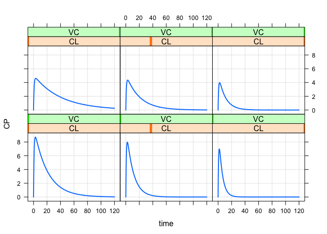

<!-- README.md is generated from README.Rmd. Please edit that file -->

# knobs

<!-- badges: start -->

<!-- badges: end -->

This package will eventually replace the “knobs” functionality found
inside of mrgsolve.

## Installation

``` r
# install.packages("devtools")
devtools::install_github("mrgsolve/knobs")
```

## Example

This is a basic example which shows you how to solve a common problem:

``` r
library(knobs)
#> Loading required package: mrgsolve
#> 
#> Attaching package: 'mrgsolve'
#> The following object is masked from 'package:stats':
#> 
#>     filter
#> 
#> Attaching package: 'knobs'
#> The following object is masked from 'package:mrgsolve':
#> 
#>     knobs
## basic example code

mrgsolve::house() %>% 
  knobs(CL = c(0.5,1,2), VC = c(10,20), amt = 100) %>%
  plot(CP ~ time|CL*VC,scales="same")
```


